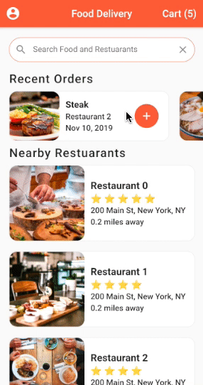

# 🍕 Food Delivery App

Food ordering application designed using flutter framework. This application implemented based on real life scenarios and UI elements are inspired from UberEats.

## Preview
<p align="center">
  
</p>

## Delivery App Features

---

- Home Screen
- Search Restuarants
- Recent Orders
- Nearby Restuarants
- Restuarant Details
- Cart

## How to Use

---

**Step 1:**

Download or clone this repo by using the link below:

```
https://github.com/dulajkavinda/food_delivery_FT.git
```

**Step 2:**

Go to project root and execute the following command in console to get the required dependencies:

```
flutter pub get 
```

**Step 3:**

This project uses `inject` library that works with code generation, execute the following command to generate files:

```
flutter packages pub run build_runner build --delete-conflicting-outputs
```

or watch command in order to keep the source code synced automatically:

```
flutter packages pub run build_runner watch
```

### **Folder Structure**

Here is the core folder structure which flutter provides.

```
flutter-app/
|- android
|- assets
|- build
|- ios
|- lib
|- test
```

Here is the folder structure we have been using in this project

```
lib/
|- data/
|- models/
|- screens/
|- widgets/
|- main.dart
```

## Authors

---

- Dulaj Kavinda

## **Copyright and license**

---

Code and documentation copyright 2020 the authors. Code released under the [MIT License]().

Enjoy 🤘
